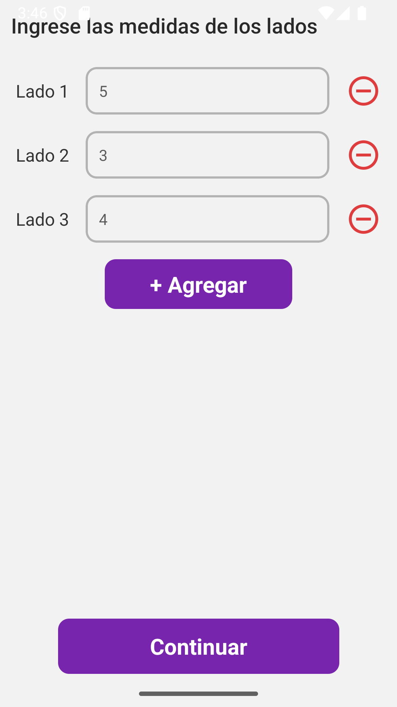
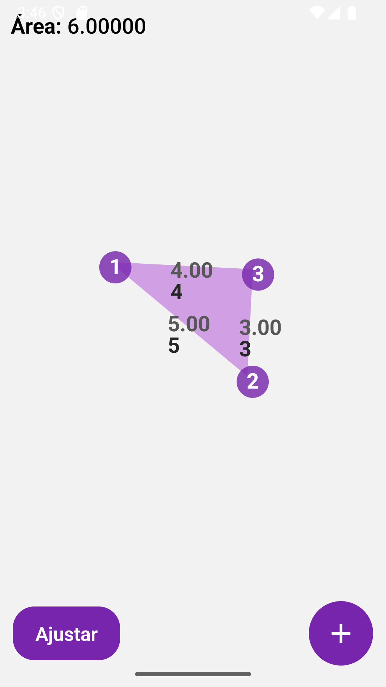
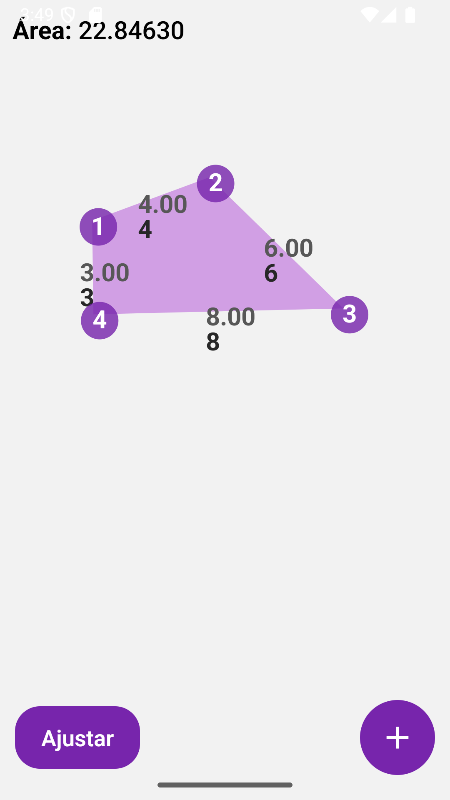
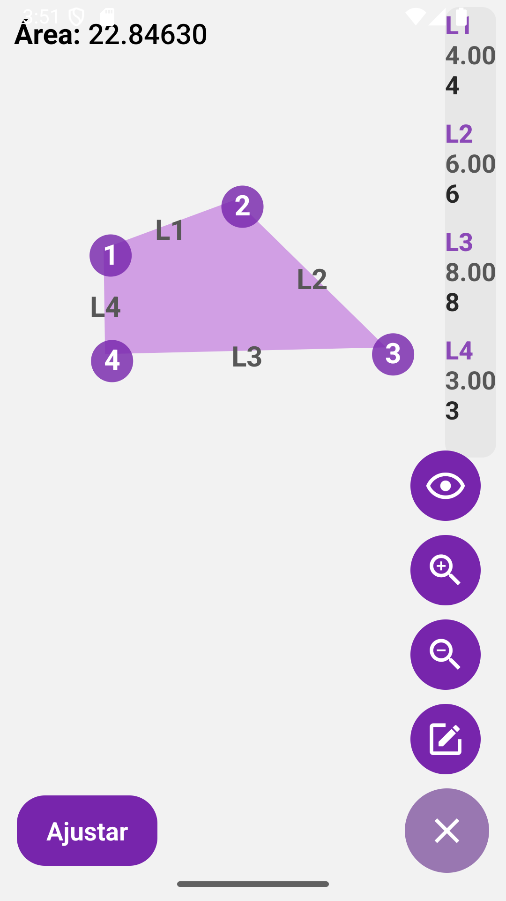

# Measurea

Measurea is a mobile application that lets you **calculate the area of any shape by simply drawing it**.  
Just add the length of the sides, sketch your figure, and instantly get the area calculated.  

Built with **React Native CLI**.

---

## Installation

Clone the repository:
```bash
git clone https://github.com/hugoruiz00/mesure.git
```

Install dependencies:
```bash
npm install
```

Run the application on Android:
```bash
npx react-native run-android
```

---

## Usage
1. Open the app  
2. Enter the side lengths
3. Draw your desired figure  
4. Get the area  

---

## License
This project is licensed under the [MIT License](LICENSE).  

## Screenshots
<p float="left">
  
  
  
  
</p>